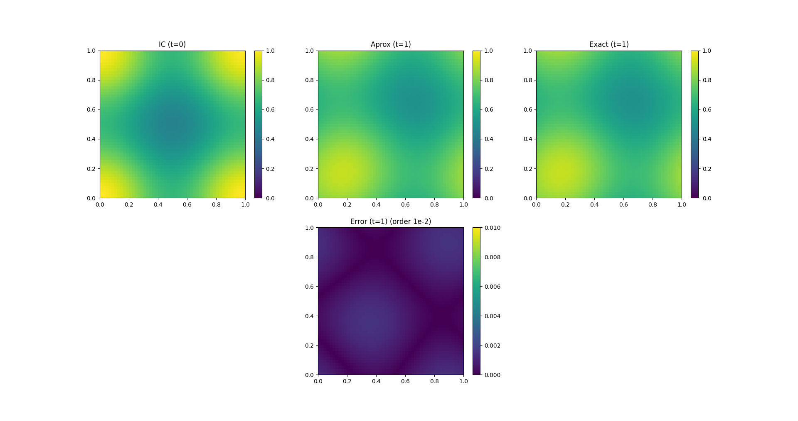

# Projector Splitter Integrator (PSI) for $$\partial_t f = -f + a(x)b(v)$$ ($\star$)

## Code
| File | Description|
| --- | --- | 
| `ksl_example` | Solver for equation ($\star$) using the KSL steps from the PSI method

## Results
| File | Description|
| --- | --- | 
| `ksl_exp_figure1.png` | Evolution of ($\star$) under sinusoidal expression for $a(x)$ and $b(v)$ and an error plot

