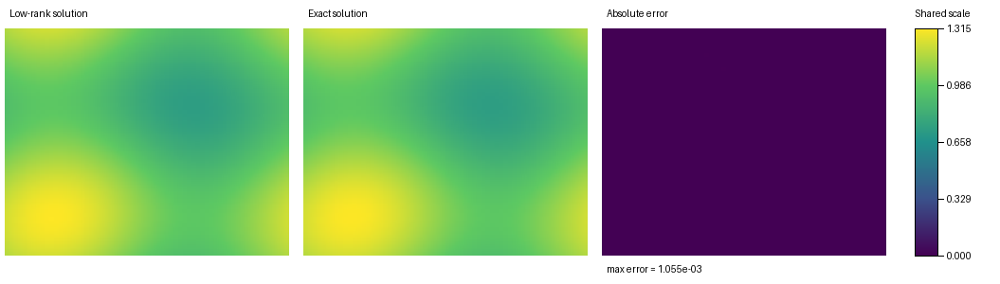

# Low-Rank Methods

This repository is dedicated to studying the original paper, reproducing its methods, and developing related numerical experiments.

## Augmented BUG Experiment 

(Archer/augmented_bug_solution.py)
1
The current code provides a small reproduction experiment using the augmented BUG method to solve

\[
\partial_t f = -f + a(x)b(v).
\]

## Result

(augmented_bug_solution.png)

The following figure shows the result produced by the code:

